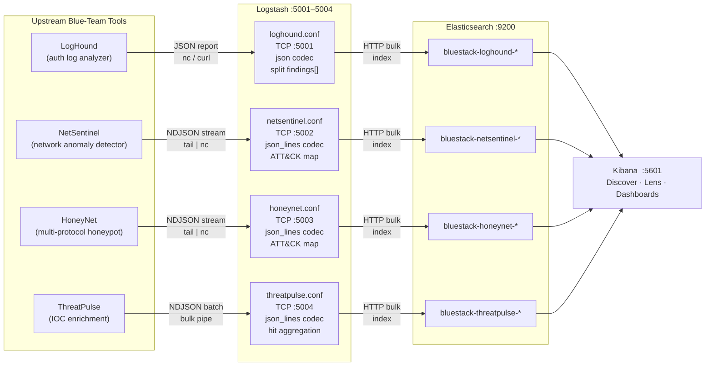

# One place to see everything

> You can have six detection tools and still see nothing — if each one logs to a different file in a different format that you read by hand.

## TL;DR

BlueStack is a pre-wired ELK stack (Elasticsearch + Logstash + Kibana) that takes the JSON output from the rest of my blue-team toolkit — LogHound, NetSentinel, HoneyNet, ThreatPulse — normalizes it, tags it with MITRE ATT&CK technique IDs, and makes it queryable in one place. One `docker compose up` and 60 seconds later, you have ~16 sample events across four indices, a Kibana data view covering all of them, and the foundation for dashboards you can actually pivot on.

---

## The problem this solves

By the time I'd shipped a handful of portfolio tools, I had a scattered detection stack:

- **LogHound** parsing `auth.log` and writing a JSON report with `findings[]` arrays and technique IDs already attached.
- **NetSentinel** emitting newline-delimited JSON events for ARP spoofs, port scans, DNS tunnels.
- **HoneyNet** streaming JSON interactions from fake SSH, HTTP, and FTP services — credential attempts, commands, path probes.
- **ThreatPulse** enriching IOC lookups against multiple threat feeds.

Every tool worked. None of them talked to each other. To answer "did the IP that NetSentinel flagged also hit the honeypot?" I had to open four terminal windows, `grep` across four log files, and mentally join them. That's not analysis — that's archaeology.

BlueStack is the integration layer. It exists so the tools can be queried together.

---

## Architecture



Each source tool gets its own dedicated Logstash TCP port and pipeline config file. That isolation matters: a parse error in the HoneyNet pipeline can't stall LogHound events. Each pipeline writes to its own daily-rolled index (`bluestack-<tool>-YYYY.MM.dd`), and a shared index template enforces correct field types across all of them — IPs as `ip`, timestamps as `date`, severities as `keyword`.

Everything binds to `127.0.0.1` by default. Nothing on this stack talks to the LAN.

---

## What the pipelines actually do

Blind JSON-forwarding would've been three lines of config. The pipelines earn their place.

### Severity normalization

Every source uses `severity`, but they disagree on casing and sometimes on vocabulary. The pipelines uppercase everything and enforce `CRITICAL / HIGH / MEDIUM / LOW / INFO` so a single Kibana filter covers all four sources.

### `source_tool` tagging

Every document that lands in Elasticsearch carries `source_tool: loghound | netsentinel | honeynet | threatpulse`. That one field is why you can build an overview dashboard that splits event counts by origin, or write a KQL query that pivots across sources in a single search bar.

### MITRE ATT&CK enrichment

This is where the pipelines do real work. Known event types are mapped to technique IDs inline:

| Source | Event type | Technique | Tactic |
|---|---|---|---|
| NetSentinel | `arp_spoof` | T1557.002 | credential-access |
| NetSentinel | `port_scan` | T1046 | discovery |
| NetSentinel | `dns_tunnel` | T1041 | exfiltration |
| NetSentinel | `dns_hijack` | T1071.004 | command-and-control |
| NetSentinel | `icmp_flood` | T1499.003 | impact |
| HoneyNet | `credential_attempt` | T1110 | credential-access |
| HoneyNet | `command_executed` | T1059 | execution |
| HoneyNet | `file_upload_attempt` | T1105 | command-and-control |
| HoneyNet | `coordinated_scan` | T1595.001 | reconnaissance |
| LogHound | *(passed through)* | e.g. T1110.001, T1548.003 | *(passed through)* |

LogHound is the only tool that already emits `mitre_technique` and `mitre_tactic` on each finding — the pipeline aliases those to the shared `mitre.technique_id` / `mitre.tactic` fields without overwriting them. Every other pipeline derives the tags from `event_type`.

The result is that in Kibana Lens, you can build a MITRE ATT&CK heatmap across all four sources with two axis configurations: X = `mitre.technique_id`, breakdown = `mitre.tactic`. No post-processing, no manual tagging.

### LogHound flattening

LogHound emits a single wrapped report — one JSON object with a `findings[]` array. That structure is useful for reading but wrong for a search index: you want each finding to be its own document so you can filter, sort, and aggregate on individual events rather than on whole scans.

The pipeline handles this with a Logstash `split` filter on the `findings` field, then a short Ruby block that promotes each finding's nested fields to the document root. Scan-level metadata (`log_file`, `log_type`, `generated_at`, `threshold`) gets hoisted onto every resulting document so nothing is lost. One report with three findings → three indexed documents, each queryable on its own.

### ThreatPulse hit aggregation

ThreatPulse accepts two input shapes on the same port — IOC lookup results (which have a `results[]` array of per-feed responses) and flat blocklist dump entries. The pipeline routes on the presence of `results`, extracts the subset of feeds that actually returned a hit into `threatpulse.hits[]`, and sets `threatpulse.hit_count`. IOCs confirmed malicious across multiple feeds surface as `severity: HIGH`; anything else is `INFO`. These documents don't carry MITRE technique IDs — they're enrichment, not detections. The intended use is as a join target: when another pipeline's event mentions a suspicious IP, you query ThreatPulse's index for that same IP to see if the feeds recognized it.

---

## Anatomy of one event

Below is a real payload from `examples/honeynet-events.jsonl` — what HoneyNet sends over the wire:

```json
{
  "timestamp": "2026-04-27T22:10:04.010000",
  "honeypot": "SSH",
  "source_ip": "185.220.101.42",
  "source_port": 54231,
  "event_type": "command_executed",
  "details": {
    "command": "uname -a; whoami; cat /etc/passwd"
  }
}
```

After the HoneyNet pipeline processes it, the document indexed into Elasticsearch looks like this (relevant fields only):

```json
{
  "@timestamp": "2026-04-27T22:10:04.010Z",
  "honeypot": "SSH",
  "source_ip": "185.220.101.42",
  "source": { "ip": "185.220.101.42" },
  "source_port": 54231,
  "event_type": "command_executed",
  "command": "uname -a; whoami; cat /etc/passwd",
  "severity": "MEDIUM",
  "mitre": {
    "technique_id": "T1059",
    "tactic": "execution"
  },
  "source_tool": "honeynet",
  "tags": ["honeynet", "deception", "honeypot"]
}
```

The raw `details` object has been flattened — `command` is now a top-level scalar that Kibana can aggregate on. `source.ip` is an ECS-aligned alias so cross-source IP filters work. `mitre.technique_id` was derived from `event_type: command_executed` by the pipeline's branching logic. This is the work Logstash is doing for every event before it touches Elasticsearch.

---

## What you can query

With the stack running and sample data loaded, Kibana's Discover against the `bluestack-*` data view gives you:

```
# All HIGH or CRITICAL events across all sources in the last hour
severity: ("HIGH" OR "CRITICAL")

# Every event touching a specific IP across all four tools
source.ip: "185.220.101.42"

# All MITRE credential-access events
mitre.tactic: "credential-access"

# Port scans and ARP spoofs from NetSentinel
source_tool: "netsentinel" AND event_type: ("port_scan" OR "arp_spoof")

# LogHound: brute-force findings only
source_tool: "loghound" AND type: "ssh_brute_force"

# Any event involving an IP that ThreatPulse has flagged
# (manual join — paste the IOC into ThreatPulse's index, compare hits)
source_tool: "threatpulse" AND threatpulse.hit_count: >0
```

The dashboards I built on top of this:

- **Overview** — event count by `source_tool`, severity distribution as a donut, top source IPs across all pipelines. The "did anything happen tonight?" view.
- **MITRE ATT&CK heatmap** — `mitre.tactic` on the Y axis, `mitre.technique_id` on X, count as fill color. Instantly shows which tactics your current detections actually cover and where there are gaps.
- **HoneyNet attacker timeline** — per-IP timeline that chains `credential_attempt` → `command_executed` together, making coordinated-scan events visually obvious when they follow brute-force clusters.
- **NetSentinel network anomalies** — split by `event_type`, maps for source IPs, and a filter bar defaulting to `HIGH OR CRITICAL`.
- **LogHound auth findings** — `severity:CRITICAL OR HIGH` sorted by `count` descending, which surfaces brute-force escalation patterns first.

Dashboards live as exported Kibana saved-object NDJSON files in `kibana/dashboards/` and are re-imported automatically by `setup.sh` on each fresh stand-up.

---

## Wiring up a real tool

Shipping events from a running tool into BlueStack is one command:

```bash
# LogHound — send a completed report
loghound auth /var/log/auth.log --output /tmp/loghound.json
nc -q1 localhost 5001 < /tmp/loghound.json

# NetSentinel — tail the live event stream
tail -F /var/log/netsentinel.json | nc -q1 localhost 5002

# HoneyNet — same pattern
tail -F logs/honeynet.json | nc -q1 localhost 5003
```

For anything beyond a one-off test, the repo ships a Filebeat `inputs.d` config under `filebeat/` that handles file tailing, offset tracking, and back-pressure — more robust than `tail | nc` for long-running ingestion.

---

## Limits and what's not there yet

**No real-time alerting.** Logstash can output to Slack or email alongside Elasticsearch, and the roadmap has a Slack sink planned for `severity:CRITICAL` events. It's not in the current build. Right now BlueStack is analysis infrastructure, not a pager.

**No TLS, no authentication.** Elasticsearch's security features are deliberately disabled. This is a lab kit sized for a laptop. The `docs/HARDENING.md` doc covers what you'd need to turn on before this ever faces a real network.

**Single-node Elasticsearch.** The compose stack uses `discovery.type=single-node` with a 1 GB heap. Fine for a lab with thousands of events; not a production cluster. The heap is tunable via `ES_HEAP` in `.env`.

**No Elastic detection rules yet.** Kibana has a full SIEM detection-rule engine (`siem.rules`) that can fire alerting on query matches. The roadmap includes a rule pack for the high-signal cases — SSH brute force → success, DNS tunnel, ARP cache poison. Writing those rules is the next step after the dashboard layer is stable.

**ThreatPulse joins are manual.** There's no automated correlation job that looks up every flagged IP in the ThreatPulse index. You do it yourself with a KQL filter. Automating that pivot — "when HoneyNet sees a credential_attempt, auto-enrich it with ThreatPulse data for the source IP" — is a Logstash HTTP filter problem. It's on the list.

---

## What I'd do differently

- **Schema-first, not pipeline-first.** I designed the Logstash pipelines before locking down the Elasticsearch index template, which meant I had field-type conflicts on the first run (`source_ip` was indexed as `text` in one pipeline and `keyword` in another). Writing `scripts/index-template.json` first and validating each pipeline against it would've saved a debug cycle.

- **Filebeat from day one.** Starting with `tail | nc` was fast for prototyping. For the final design, Filebeat's offset tracking and registry file are worth the extra config even for a lab — `tail | nc` has no recovery story if the Logstash container restarts mid-stream.

- **Pre-built dashboards checked in.** The README describes five dashboards and explains exactly how to build them. They aren't in the repo yet as saved-object exports. That's a gap — a fresh clone doesn't give you the dashboards, just the instructions to build them. The next push will fix that.

---

## Resources

- [Elastic Stack 8.x docs](https://www.elastic.co/guide/en/elastic-stack/current/index.html) — the Logstash filter reference is where I spent the most time
- [MITRE ATT&CK Navigator](https://mitre-attack.github.io/attack-navigator/) — for validating the technique IDs and building coverage layers
- [Elastic Common Schema (ECS)](https://www.elastic.co/guide/en/ecs/current/index.html) — the field naming spec I aligned `source.ip`, `destination.address`, etc. to
- The repo: [github.com/B0bTheSkull/bluestack](https://github.com/B0bTheSkull/bluestack)
